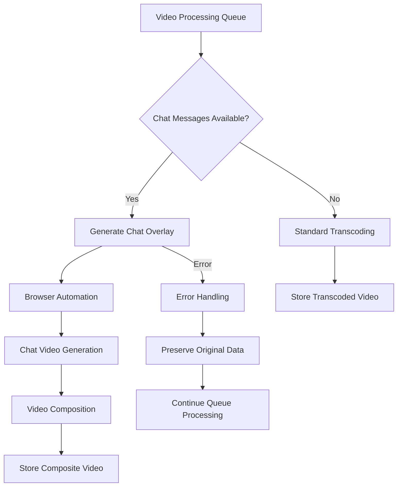
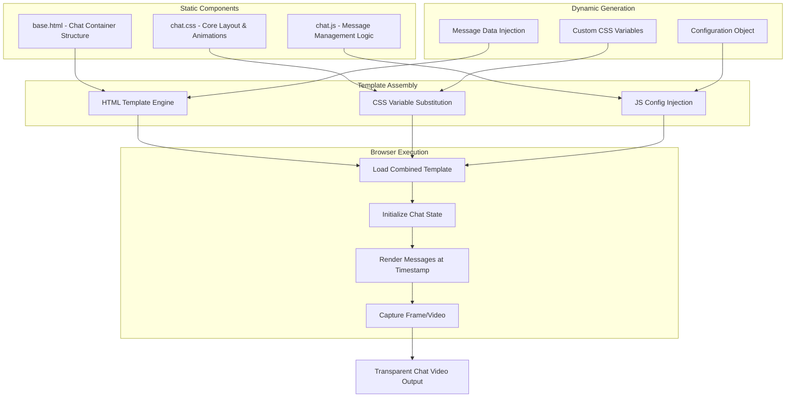

# Design Document

## Overview

The Twitch Chat Overlay feature extends the existing video processing pipeline to generate composite videos that include both the original stream content and a synchronized chat overlay. The system uses a headless browser (Playwright with Chromium) to reconstruct the chat interface from stored message data, generates a transparent chat video, and composites it with the original stream video.

The design integrates seamlessly with the existing transcoding workflow, falling back to standard transcoding when chat data is unavailable or when overlay generation fails. This ensures system reliability while providing enhanced functionality when possible.

## Architecture

### High-Level Flow



### Integration Points

The chat overlay system integrates with existing components:

- **Transcoding Pipeline**: Extends `vodloader.post.transcoding` module
- **Database Models**: Uses existing `Message`, `VideoFile`, and `ChannelConfig` models
- **Queue System**: Leverages existing `transcode_queue` infrastructure
- **API Layer**: Extends existing `vodloader.api` endpoints for configuration management
- **Error Handling**: Follows established logging and error management patterns

### Browser Automation Architecture



**Static Components Detail:**
- `base.html`: Contains the fundamental chat window structure, message containers, and DOM elements
- `chat.css`: Defines core layout rules, message animations, scrolling behavior, and visual styling framework
- `chat.js`: Implements message lifecycle management, DOM manipulation, and deterministic positioning logic

**Template File Location:**
Static template files will be stored in `app/vodloader/post/chat_templates/` directory:
- `app/vodloader/post/chat_templates/base.html`
- `app/vodloader/post/chat_templates/chat.css`
- `app/vodloader/post/chat_templates/chat.js`

**Dynamic Components Detail:**
- **Message Data**: JSON injection of filtered messages with timestamps and user data
- **CSS Variables**: Font family, colors, dimensions, positioning values from ChannelConfig
- **Configuration Object**: Runtime settings for message duration, overlay dimensions, and behavior parameters

## Components and Interfaces

### 1. Chat Video Generator (`chat_video.py`)

**Primary Interface:**
```python
async def generate_chat_video(video: VideoFile) -> Optional[Path]:
    """
    Generate chat overlay video for a given video file.
    
    Args:
        video: VideoFile instance to process
        
    Returns:
        Path to composite video if successful, None if no chat data
        
    Raises:
        ChatOverlayError: For recoverable errors that should be retried
        Exception: For unrecoverable errors
    """
```

**Key Responsibilities:**
- Coordinate the entire chat overlay generation process
- Extract video metadata (frame rate, duration, dimensions) from original file
- Manage browser lifecycle and resource cleanup
- Handle fallback scenarios and error conditions
- Integrate with existing transcoding workflow

### 2. Browser Manager (`browser_manager.py`)

**Primary Interface:**
```python
class BrowserManager:
    async def __aenter__(self) -> playwright.Browser:
        """Context manager entry - initialize browser"""
        
    async def __aexit__(self, exc_type, exc_val, exc_tb):
        """Context manager exit - cleanup browser resources"""
        
    async def create_chat_page(self, config: ChatConfig) -> playwright.Page:
        """Create and configure a page for chat rendering"""
```

**Key Responsibilities:**
- Manage Playwright browser instances
- Handle browser process lifecycle
- Provide resource cleanup and error recovery
- Configure browser settings for video capture

### 3. Chat Renderer (`chat_renderer.py`)

**Primary Interface:**
```python
class ChatRenderer:
    def __init__(self, messages: List[Message], config: ChannelConfig, video_info: Dict):
        """Initialize renderer with messages, configuration, and video metadata"""
        
    async def render_to_video(self, page: playwright.Page, output_path: Path) -> None:
        """Render chat messages to video file with transparent background matching original frame rate"""
```

**Key Responsibilities:**
- Generate HTML/CSS/JS for chat interface
- Implement deterministic message positioning
- Handle message timing and visibility calculations
- Extract and match original video frame rate
- Coordinate video recording process with proper timing

### 4. Extended ChannelConfig Methods

**Configuration Access Methods:**
```python
class ChannelConfig(BaseModel):
    # ... existing and new fields
    
    def get_chat_font_family(self) -> str:
        return self.chat_font_family or "Roboto Mono"
    
    def get_chat_font_size(self) -> int:
        return self.chat_font_size or 14
    
    def get_chat_font_style(self) -> str:
        return self.chat_font_style or "normal"
    
    def get_chat_font_weight(self) -> str:
        return self.chat_font_weight or "normal"
    
    def get_chat_text_color(self) -> str:
        return self.chat_text_color or "#ffffff"
    
    def get_chat_text_shadow_color(self) -> str:
        return self.chat_text_shadow_color or "#000000"
    
    def get_chat_text_shadow_size(self) -> int:
        return self.chat_text_shadow_size or 1
    
    def get_chat_position(self) -> str:
        return self.chat_position or "top-left"
    
    def get_chat_padding(self) -> int:
        return self.chat_padding or 20
    
    def get_chat_message_duration(self) -> float:
        return self.chat_message_duration or 30.0
    
    def get_keep_chat_overlay(self) -> bool:
        return self.keep_chat_overlay if self.keep_chat_overlay is not None else True
```

**Benefits of This Approach:**
- Single source of truth in the database model
- No data mapping or separate dataclass maintenance
- Follows existing codebase patterns
- Simpler to use: `config.get_chat_font_family()` instead of creating separate objects
- Type safety with return type hints

### 5. Video Compositor (`video_compositor.py`)

**Primary Interface:**
```python
async def composite_videos(
    original_path: Path,
    overlay_path: Path,
    output_path: Path,
    config: ChannelConfig
) -> None:
    """Composite original video with chat overlay ensuring frame rate synchronization"""
```

**Key Responsibilities:**
- Use FFmpeg to composite videos with matched frame rates
- Handle overlay positioning and scaling
- Maintain original video quality and temporal characteristics
- Verify frame rate compatibility before composition
- Manage temporary file cleanup

### 6. API Extensions (`api/channel_config.py`)

**New API Endpoints:**
```python
# GET /api/channels/{channel_id}/config/chat
async def get_chat_config(channel_id: int) -> dict:
    """Get chat overlay configuration for a channel"""

# PUT /api/channels/{channel_id}/config/chat  
async def update_chat_config(channel_id: int, config: dict) -> dict:
    """Update chat overlay configuration for a channel"""

# POST /api/channels/{channel_id}/config/chat/reset
async def reset_chat_config(channel_id: int) -> dict:
    """Reset chat overlay configuration to defaults"""
```

**Configuration Schema:**
```python
{
    "font_family": "string",
    "font_size": "integer", 
    "font_style": "string",
    "font_weight": "string",
    "text_color": "string",
    "text_shadow_color": "string", 
    "text_shadow_size": "integer",
    "overlay_width": "integer|null",
    "overlay_height": "integer|null", 
    "position": "string",
    "padding": "integer",
    "message_duration": "float",
    "keep_chat_overlay": "boolean"
}
```

**Key Responsibilities:**
- Expose chat overlay configuration through REST API
- Validate configuration values and constraints
- Handle partial updates (only provided fields)
- Return current effective configuration (including defaults)
- Integrate with existing channel configuration endpoints

## Data Models

### Extended ChannelConfig Model

The existing `ChannelConfig` model will be extended to support chat overlay settings. This approach maintains the existing one-to-one relationship with TwitchChannel while adding chat-specific configuration:

**Updated Table Creation:**
The `ChannelConfig.table_command` will be updated to include the new chat overlay fields directly in the CREATE TABLE statement:

```sql
CREATE TABLE IF NOT EXISTS channel_config (
    id INT UNSIGNED NOT NULL UNIQUE,
    quality VARCHAR(8) NOT NULL DEFAULT 'best',
    delete_original_video BOOL NOT NULL,
    chat_font_family VARCHAR(100) DEFAULT NULL,
    chat_font_size INT DEFAULT NULL,
    chat_font_style VARCHAR(20) DEFAULT NULL,
    chat_font_weight VARCHAR(20) DEFAULT NULL,
    chat_text_color VARCHAR(7) DEFAULT NULL,
    chat_text_shadow_color VARCHAR(7) DEFAULT NULL,
    chat_text_shadow_size INT DEFAULT NULL,
    chat_overlay_width INT DEFAULT NULL,
    chat_overlay_height INT DEFAULT NULL,
    chat_position VARCHAR(20) DEFAULT NULL,
    chat_padding INT DEFAULT NULL,
    chat_message_duration FLOAT DEFAULT NULL,
    keep_chat_overlay BOOL DEFAULT TRUE,
    PRIMARY KEY (id),
    FOREIGN KEY (id) REFERENCES twitch_channel(id) ON DELETE CASCADE
);
```

**Updated Model:**
```python
class ChannelConfig(BaseModel):
    # Existing fields
    id: int
    quality: str
    delete_original_video: bool
    
    # New chat overlay fields (all nullable for backward compatibility)
    chat_font_family: Optional[str] = None
    chat_font_size: Optional[int] = None
    chat_font_style: Optional[str] = None
    chat_font_weight: Optional[str] = None  # normal, bold, 100-900
    chat_text_color: Optional[str] = None
    chat_text_shadow_color: Optional[str] = None
    chat_text_shadow_size: Optional[int] = None
    chat_overlay_width: Optional[int] = None
    chat_overlay_height: Optional[int] = None
    chat_position: Optional[str] = None
    chat_padding: Optional[int] = None
    chat_message_duration: Optional[float] = None
    keep_chat_overlay: Optional[bool] = None
```

**Benefits of This Approach:**
- Maintains existing foreign key relationship: `ChannelConfig.id -> TwitchChannel.id`
- Single query to get all channel configuration
- Backward compatible with existing code
- Follows established pattern in the codebase
- Atomic updates for all channel settings

### Processing State Management

The existing `VideoFile.transcode_path` field serves as the processing state indicator:

- **`transcode_path = None`**: Video needs processing (chat overlay or standard transcoding)
- **`transcode_path = Path`**: Video has been successfully processed

This approach leverages the existing data model and queue system without requiring additional state tracking tables. The `get_nontranscoded()` method already filters for videos where `transcode_path` is `None`, making integration seamless.

## Error Handling

### Error Classification

1. **Recoverable Errors** (preserve data, allow retry):
   - Browser automation failures
   - Temporary file system issues
   - Memory/resource constraints
   - Network timeouts

2. **Data Errors** (skip processing, log for debugging):
   - Corrupted chat data
   - Invalid message timestamps
   - Missing required fields

3. **Configuration Errors** (use defaults, continue processing):
   - Invalid font specifications
   - Invalid positioning values
   - Missing configuration values

### Error Handling Strategy

```python
class ChatOverlayError(Exception):
    """Base exception for recoverable chat overlay errors"""
    pass

class ChatDataError(Exception):
    """Exception for corrupted or invalid chat data"""
    pass

async def safe_generate_chat_video(video: VideoFile) -> Optional[Path]:
    """
    Wrapper that implements comprehensive error handling
    """
    try:
        return await generate_chat_video(video)
    except ChatDataError as e:
        logger.error(f"Chat data error for video {video.id}: {e}")
        # Log for debugging but don't retry - leave transcode_path as None
        return None
    except ChatOverlayError as e:
        logger.error(f"Recoverable chat overlay error for video {video.id}: {e}")
        # Leave transcode_path as None for retry by queue system
        return None
    except Exception as e:
        logger.error(f"Unexpected error generating chat overlay for video {video.id}: {e}")
        # Log stack trace, preserve data, leave transcode_path as None for retry
        return None
```

### Resource Management

- **Browser Process Management**: Automatic cleanup of browser processes on failure
- **Temporary File Cleanup**: Cleanup of partial files on errors
- **Memory Monitoring**: Process termination if memory usage exceeds 2GB per browser instance
- **Timeout Handling**: 
  - Page load timeout: 30 seconds
  - Video recording timeout: 5 minutes per minute of source video
  - Browser operation timeout: 60 seconds for individual operations
- **Process Limits**: Maximum 1 browser instance per video processing to avoid resource conflicts

## Testing Strategy

### Development Testing

During development, temporary test files may be created to validate functionality:

- **Configuration validation**: Verify default values and database integration work correctly
- **Message processing**: Ensure timestamp calculations and deterministic positioning function as expected  
- **Browser automation**: Validate page creation, video recording, and resource cleanup
- **Video composition**: Verify end-to-end processing and frame rate matching
- **Error handling**: Test browser crash recovery and invalid data scenarios

These test files are for development validation only and will not be maintained as part of the ongoing codebase. The primary validation will come from real-world usage and monitoring of the production system.

## Implementation Phases

### Phase 1: Core Infrastructure
- Browser manager implementation
- Basic chat renderer
- Configuration system
- Error handling framework

### Phase 2: Chat Video Generation
- Video metadata extraction and frame rate detection
- Message processing logic
- HTML/CSS/JS template system
- Video recording functionality with frame rate matching
- Deterministic positioning

### Phase 3: Video Composition
- FFmpeg integration with frame rate synchronization
- Overlay positioning and scaling
- File management
- Quality and temporal characteristics preservation

### Phase 4: Integration & Validation
- Transcoding pipeline integration
- Comprehensive error handling
- Performance optimization
- Development validation and cleanup

## Dependencies

### New Dependencies
- `playwright`: Browser automation framework
- `playwright[chromium]`: Chromium browser for Playwright

### Existing Dependencies (leveraged)
- `ffmpeg-python`: Video composition
- `aiosqlite`/`aiomysql`: Database operations
- `asyncio`: Async processing
- Standard logging framework

## Security Considerations

1. **Browser Security**: Headless browser runs in isolated environment
2. **File System Access**: Restricted to designated video processing directories  
3. **Resource Limits**: Memory and CPU usage monitoring and limits
4. **Input Validation**: Sanitization of chat message content for HTML rendering
5. **Process Isolation**: Browser processes run with minimal privileges

## Performance Considerations

1. **Memory Management**: Browser process memory monitoring and cleanup
2. **Concurrent Processing**: Single browser instance per video to avoid resource conflicts
3. **File I/O Optimization**: Streaming video processing where possible
4. **Queue Management**: Balanced processing to avoid system overload
5. **Caching**: Template and configuration caching for repeated operations